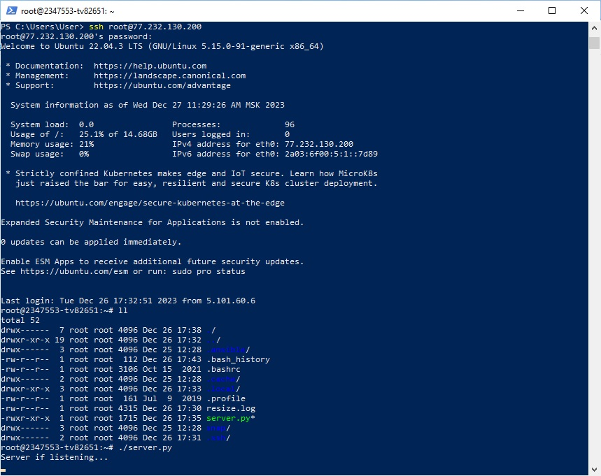
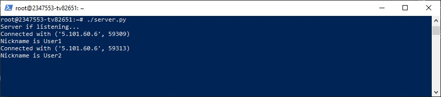
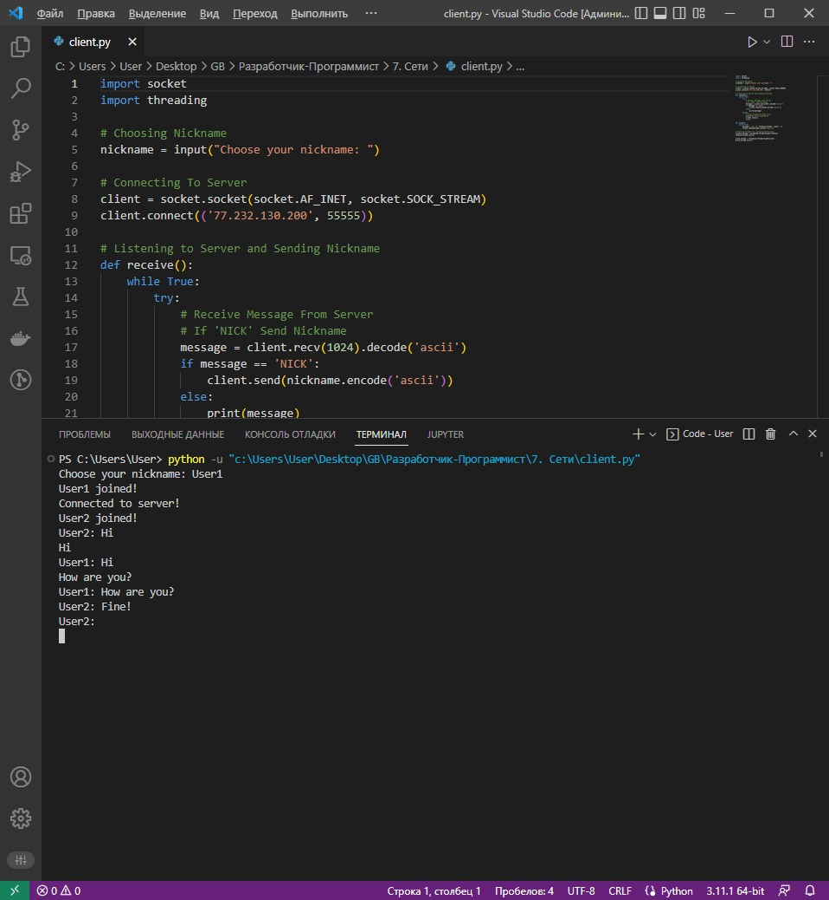
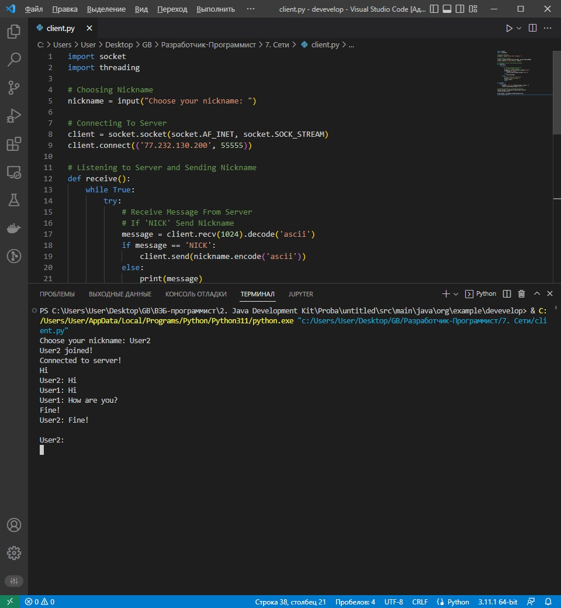
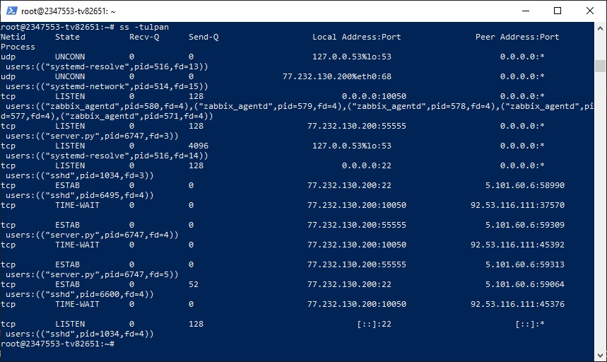
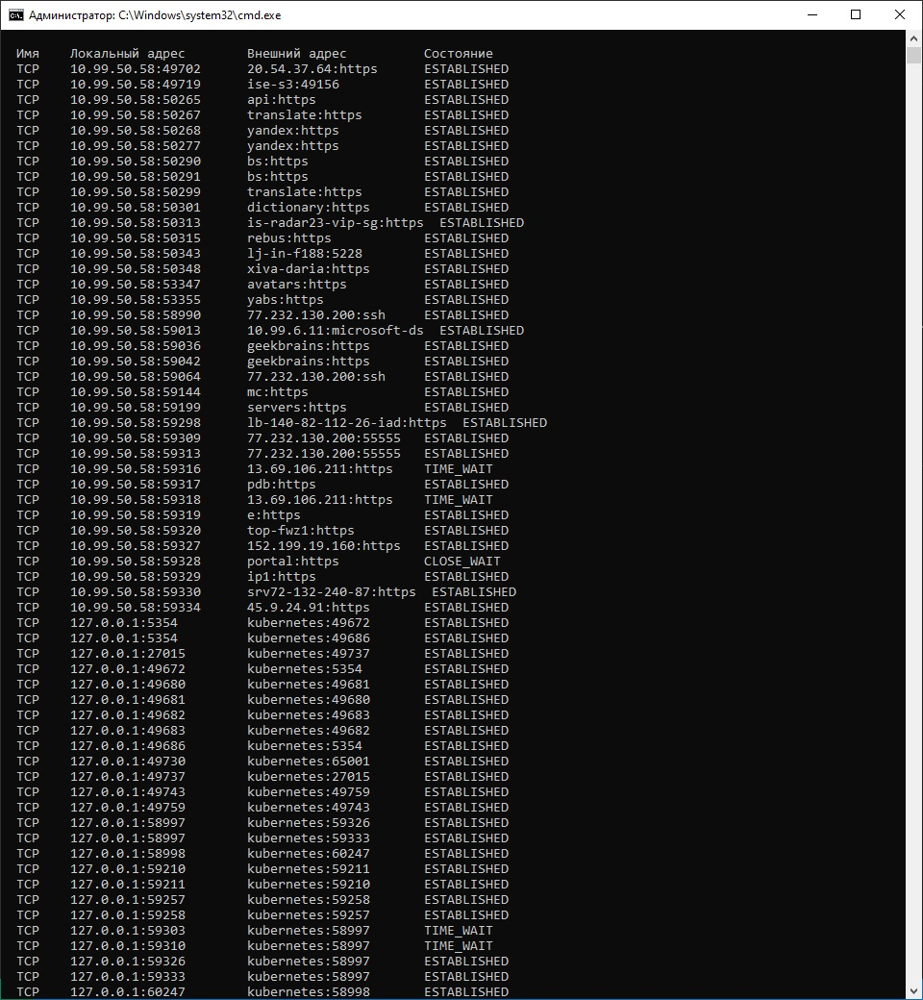
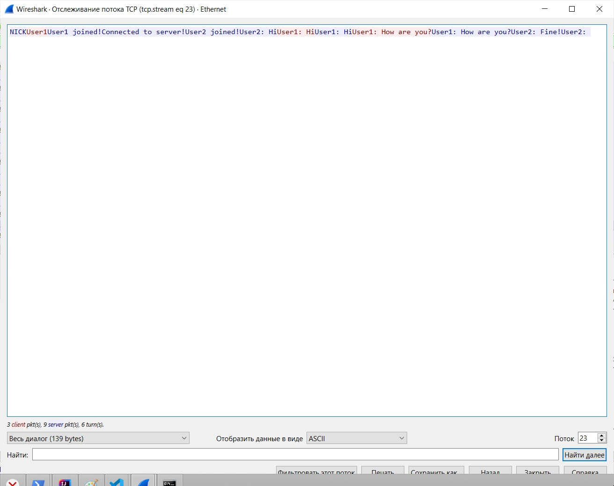

1. Пробовал на Java клиента написать (Client.java), есть недочеты (без нажатия Enter в консоли ничего не появляется),\
надо серверную часть переделывать.
2. Реализовал на вашем коде: 2 клиента и удаленный сервер:\
\
\
\
\
3. Сокеты:\
\
\
4. Wireshark:\
